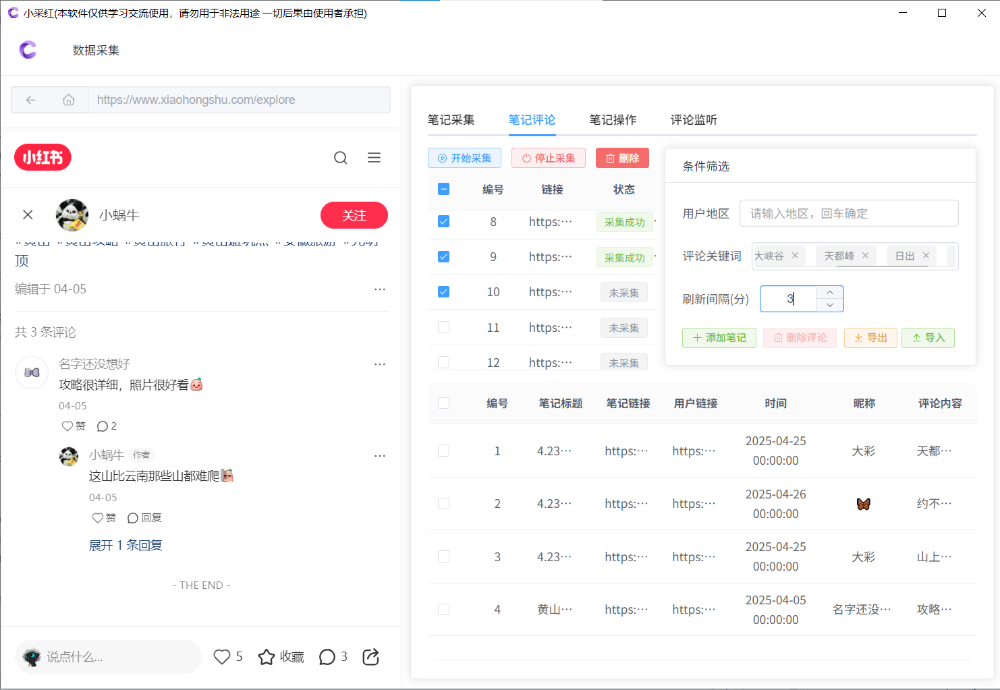
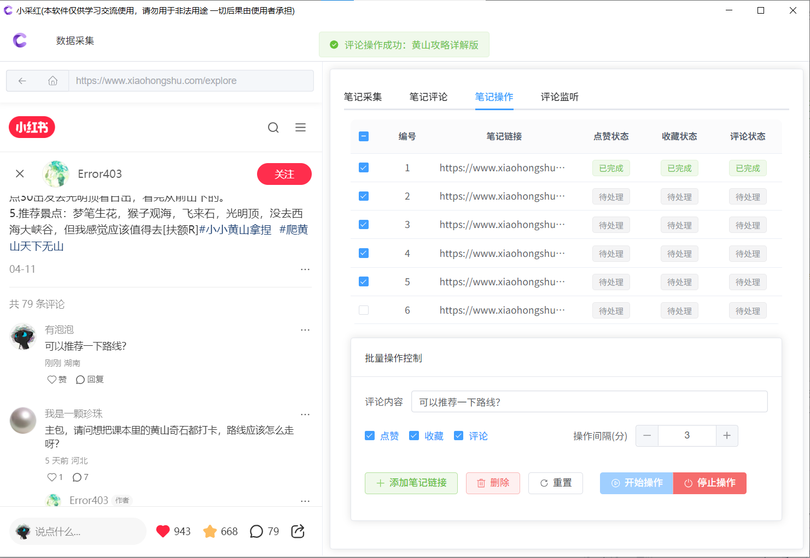
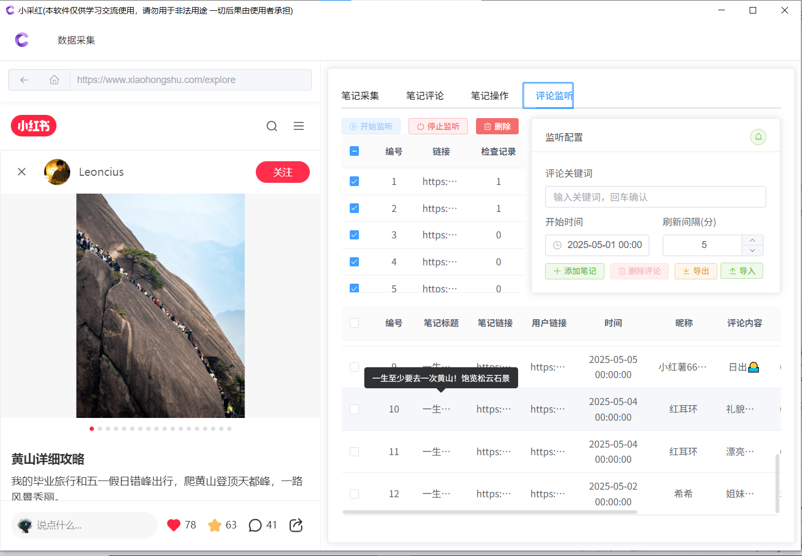

# 小采红基本介绍
> 本软件工具仅限于学术交流使用，严格遵循相关法律法规，符合平台内容合法合规性，禁止用于任何商业用途！ 🌟小红书数据探索神器来袭！🎈新手入门必备！🚀小采红，小红书数据采集自动化解决方案！🔓专注小红书数据精准抓取！

📌小采红是一款围绕小红书生态精心打造的数据采集软件，💥为小红书运营者打造专属自动化工作流。有效避免传统采集方式的繁琐与低效。巧妙避开常规采集方式易受限、不精准的问题。💡操作便捷易懂，功能全面强大，无论是品牌方洞察市场趋势，还是博主分析粉丝偏好，都能轻松助力！👏

# 小采红软件功能
🎈 自动化数据采集：在 “笔记采集” 界面，能按设定关键词，比如 “旅游攻略”、“美食探店” 等。还能按综合、点赞数等规则排序，不管是攻略、风景还是其他类型笔记，都给你整整齐齐列出来，轻松掌握热门内容风向🧭

💬 精准评论管理：“笔记评论” 功能里，能通过设置用户地区、评论关键词筛选 。采集相关笔记评论就被抓取，还会实时更新。采集的数据能导出，帮你深挖用户想法💡。

👍 互动笔记：在 “笔记操作” 板块，勾选笔记链接，就能批量设置点赞、收藏、评论 。设置好评论内容，像 “求分享路线”，再定个操作间隔，就能自动互动，高效运营小红书账号🤳

🔔 评论监听：“评论监听” 超贴心，输入 “日出” 等关键词，设定好时间和刷新间隔，点 “开始监听” ，一旦有符合关键词的新评论出现，马上通知你，不错过任何和用户交流的机会🤗。

# 小采红官方网址
小采红官方网址为：https://f1num.github.io/XiaoCaiHong-xhs/ ，您可通过该网址直达小采红软件的官方平台。 下载软件地址：https://wwvz.lanzouw.com/ip0Dx3c12tdg 密码：xch8。
若网址暂未补充完整，您还可通过以下方式获取软件相关资源与咨询：

# 🔥小采红软件专属咨询
这里是获取小采红软件及专业咨询的一站式平台！无论你想深度了解软件功能、解决使用疑问，还是快速获取小采红安装包，都能在这里找到答案。专注小红书数据采集与运营的小采红，助你高效挖掘平台价值！

🚀入群指南：
软件咨询群：`1023766193` 也可以扫描下方二维码立即进群，回复【小采红】即可获取软件资源与专属咨询通道！从 0 到 1 解锁小红书数据宝藏，就差这一步！

